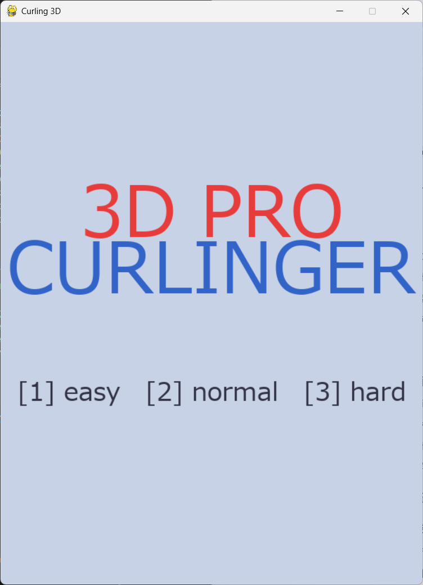
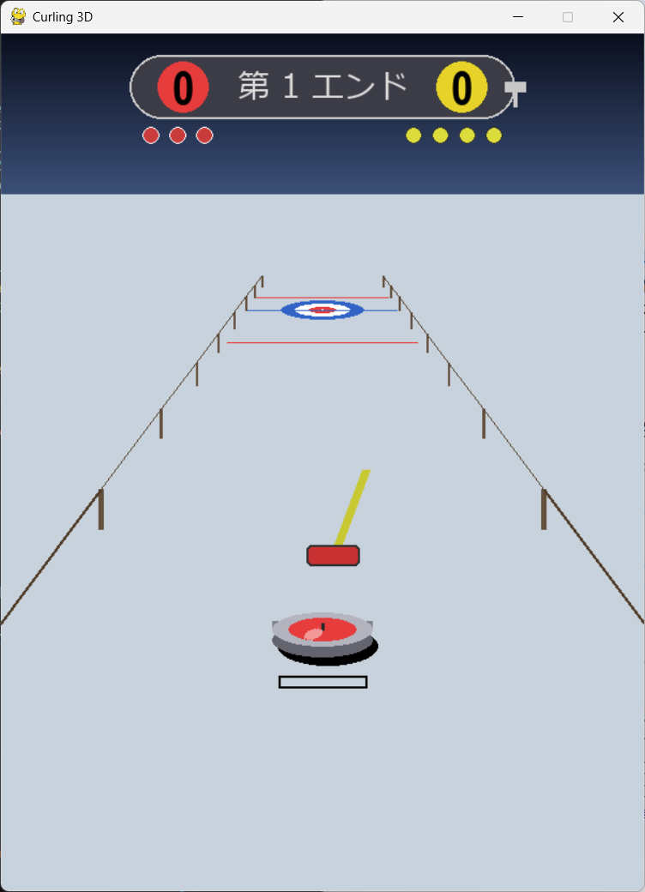
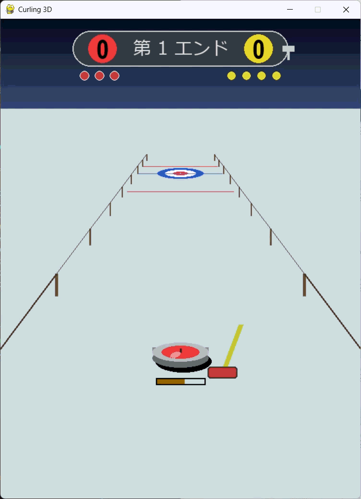
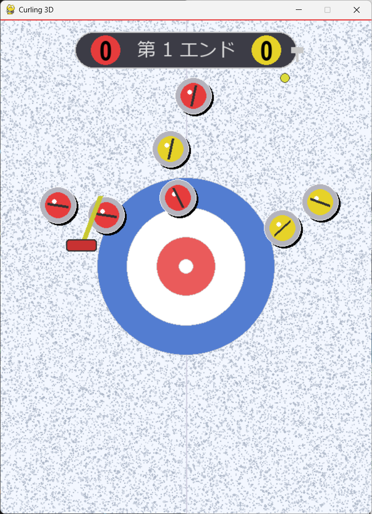
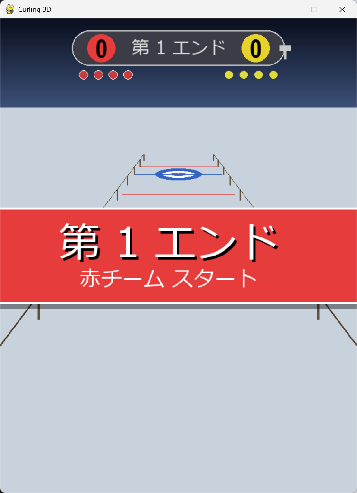

# 3D PRO CURLINGER - 本格3Dカーリングシミュレーター

  

## 作品概要

本作は、Pythonのゲームライブラリ「Pygame」を用いて開発された、本格的な3Dカーリングゲームです。「氷上のチェス」とも呼ばれるカーリングの持つ緻密な戦略性と、一投に懸ける緊張感を、自作の擬似3Dエンジンと物理演算によってデジタル空間に再現しました。

プレイヤーはレッドチーム（先攻・後攻はルール準拠）を操作し、3段階の難易度を持つAI（イエローチーム）と対戦します。単にストーンを投げるだけでなく、パワーゲージによる力加減、リリースの角度調整、そしてカーリングの醍醐味である「スイーピング（ブラシで氷を擦る動作）」までを実装しています。

**こだわりポイント：**
視覚表現においては、遠近法を用いた透視投影変換（Perspective Projection）をスクリプト上で計算し、奥行きのある3D空間を描画しています。ストーンが手元にあるうちは臨場感のある「3D視点」で、ハウス（標的）に近づくと戦況を把握しやすい「トップダウン（2D）視点」へとシームレスにカメラが切り替わる演出を取り入れました。

**物理挙動とゲーム性：**
物理エンジンも独自に実装しており、ストーン同士が衝突した際の運動量保存則に基づいた反発や、摩擦係数の変化による減速挙動をシミュレートしています。特にスイーピング操作はゲームの肝であり、マウスを激しく動かすことで動的に摩擦を減らし、ストーンの飛距離を伸ばしたり、曲がり具合（カール）を微調整したりすることが可能です。その他、試合を盛り上げるカットイン演出、正確なスコアリングシステム、ハンマー（後攻権）の表示など、実際の試合中継のようなUIデザインにも注力しました。

静寂な氷上の雰囲気と、ラストストーンを巡る熱い駆け引きをぜひ体験してください。

## ギャラリー

| タイトル画面 | 投球・エイミング画面 |
|:-:|:-:|
|  |  |
| **難易度選択とタイトルロゴ** | **3D視点でのパワー調整と方向決定** |

| スイーピング操作 | ハウス内の攻防 |
|:-:|:-:|
|  |  |
| **マウス操作で氷を磨く「SWEEP!」演出** | **ハウス接近時のトップダウン視点切り替え** |

  
   
  <b>ターン経過を告げるカットインアニメーション</b>

## 操作方法

| キー / 操作 | 動作 |
|:---:|:---|
| **← / →** | 投球方向（位置）の微調整 |
| **SPACE (長押し)** | パワーチャージ（離すと投球） |
| **マウス移動 (ドラッグ)** | スイーピング（投球後、ストーンの前を擦って滑りを良くする） |
| **1 / 2 / 3** | タイトル画面での難易度選択 (Easy / Normal / Hard) |

## 開発環境・要件

* **言語:** Python
* **開発期間:** 2025/12 - 2026/01
